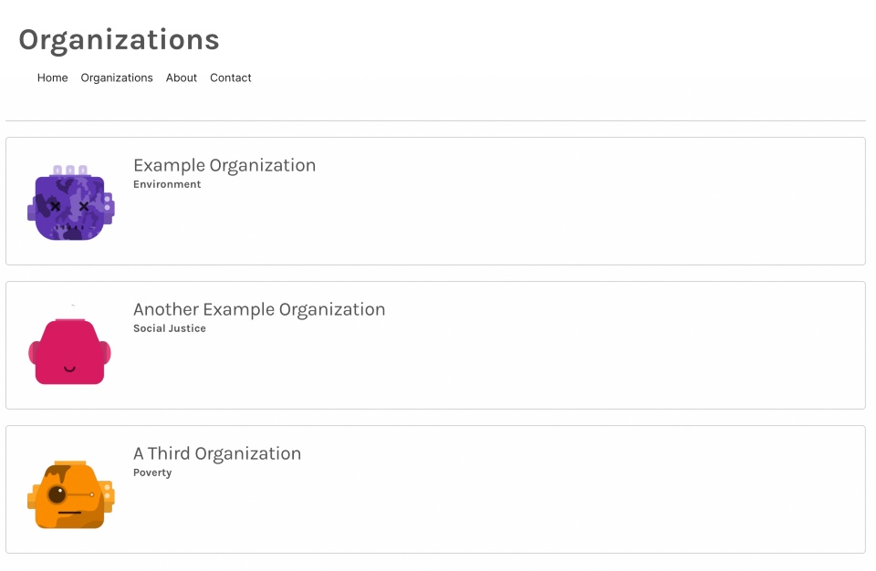

#### Groundswell unlocks philanthropic giving at scale by making charity an employee benefit, giving people the power of a personal foundation in the palm of their hand: a 401K for giving.

## Instructions

1. Add a new menu item "Organizations" to the Header navigation menu 
2. Create a page for the new item that reaches out to 'https://gs.npkn.net/npo' (axios is already in the dependencies)
3. Display the list of Non Profit Organizations that are returned on the new Organizations page
4. Clicking on an individual Non Profit Organization should navigate to a screen that displays the individual 
   organization info: avatar, name, type, and description
5. Add tests for the new page

See app/assets/screenshots for a rough mockup, feel free to add your own style to it:

## Available Scripts

To install the dependencies, run:

### `yarn install`

To run the app:

### `yarn start`

Open [http://localhost:3000](http://localhost:3000) to view it in the browser.

### `yarn test`

Launches the test runner in the interactive watch mode.\
See the section about [running tests](https://facebook.github.io/create-react-app/docs/running-tests) for more information.

## License

None, implied or granted.
